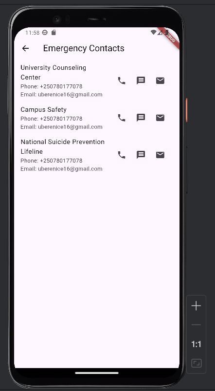
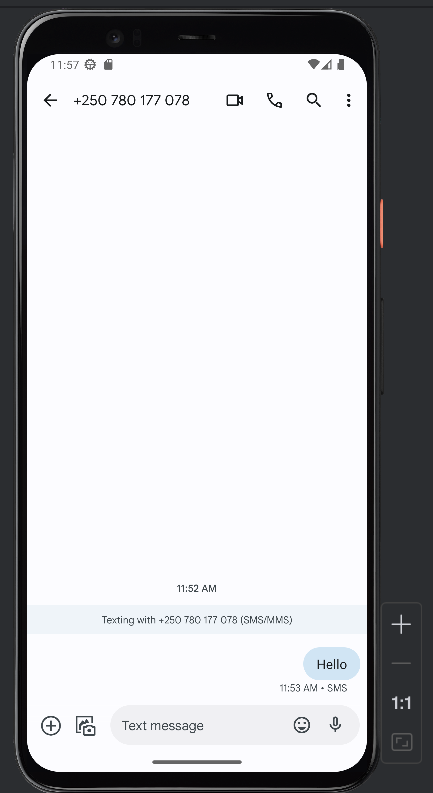

# Mindfulness

Student Wellness App

## Getting Started

This project is a mental wellness app designed to help students track their moods,
write journal entries, and connect with peer support groups.

## Some screenshots from the project

### Home Screen

### Mood Tracker Screen

### Journal Entry Screen

### Peer Support chat Screen

### Emergency Contacts Screen

### Meditation Screen

### History Screen

### Firebase Database

